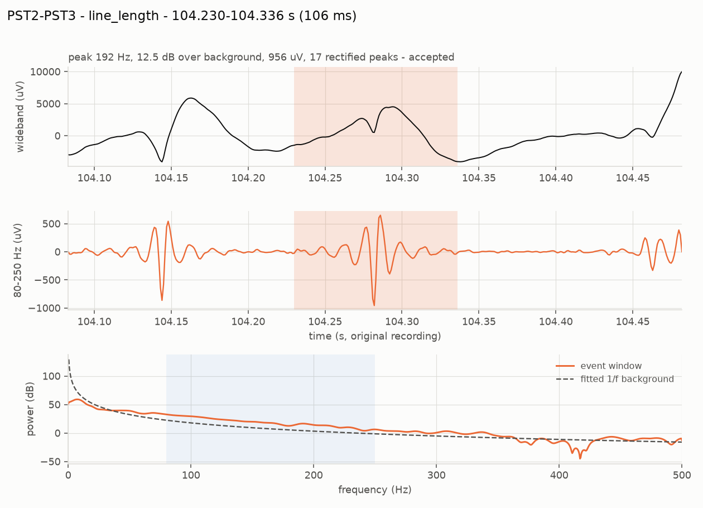
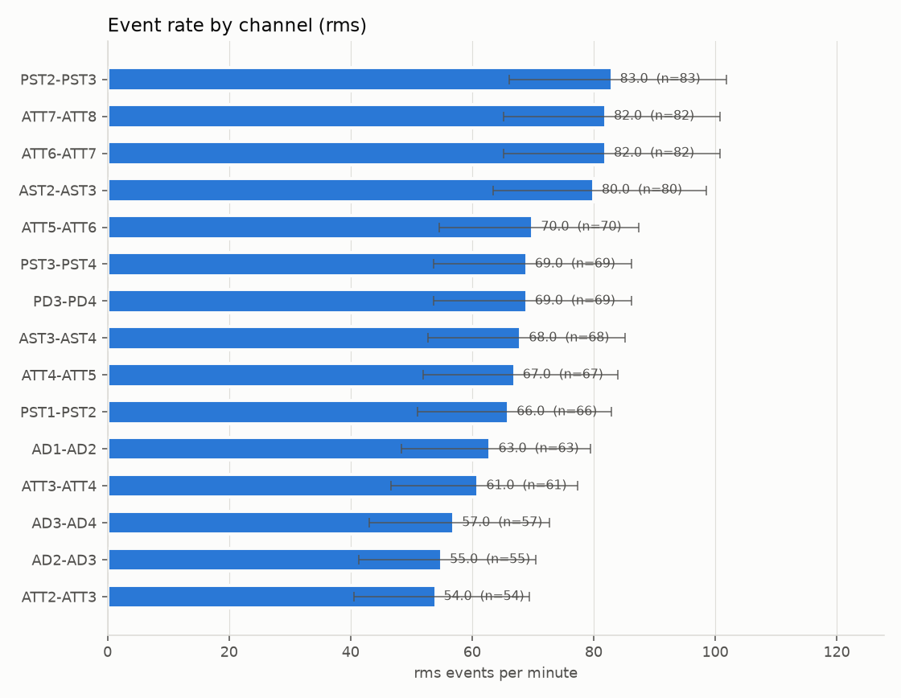
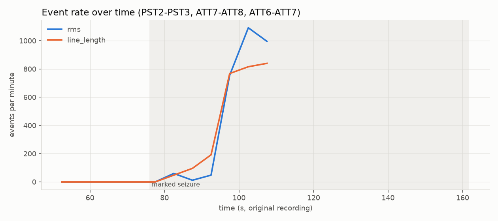
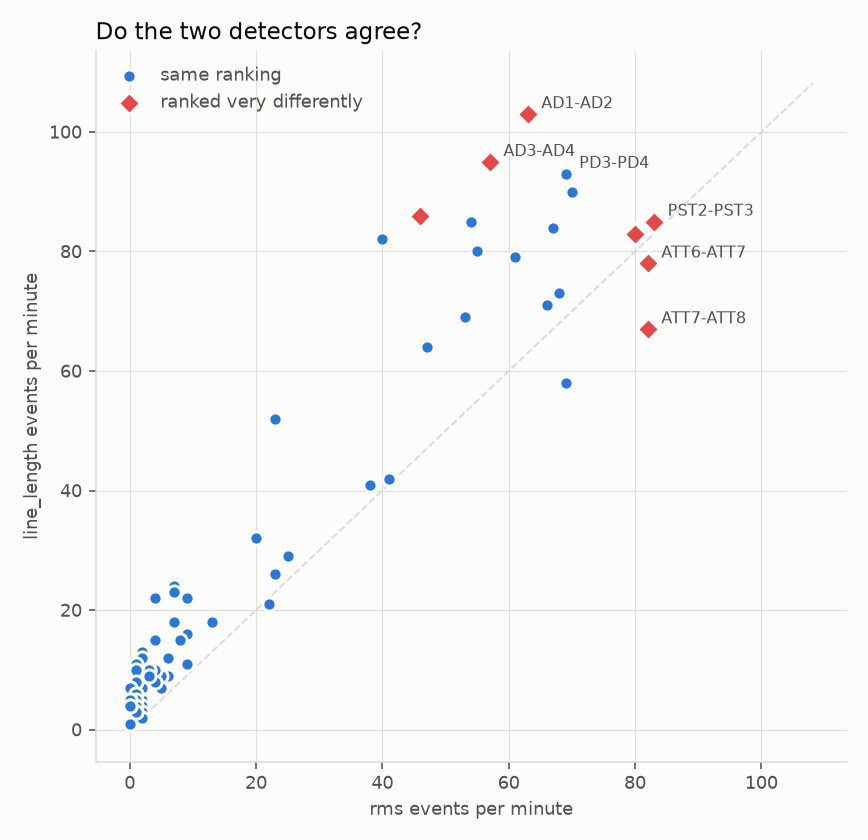

# Onset-HFO — a first prototype for HFO and epileptiform-discharge detection

**Two halves, deliberately separate.**

1. **A signal-processing pipeline** that takes one minute of real, public
   intracranial EEG and reports where high-frequency oscillations (ripples,
   80–250 Hz) and interictal epileptiform discharges occur, with the exact
   signal window behind every number.
2. **An agent built on an open-weight language model** that can read what the
   pipeline produced, must cite it, and is refused, checked and contradicted
   by code whenever it strays.

It is a **prototype**: small, readable, measured, and honest about what it
cannot do. It is not a medical device and it makes no clinical claim. It is
the smallest thing that is genuinely *useful to argue with*, built so that the
next person can extend it — see [`docs/ROADMAP.md`](docs/ROADMAP.md).

This sits under the [Onset](https://berdakh.github.io/onset/) project
(Brain–Machine Interfaces Lab, Nazarbayev University) and inherits its
principles: every score carries the window it looked at, disagreement is
reported rather than averaged away, and **no recommendation exists anywhere in
the schema**.

---

## Start here (three notebooks, no setup)

| | Notebook | What it does | Needs |
|---|---|---|---|
| 1 | [**HFO detection quickstart**](notebooks/01_hfo_detection_quickstart.ipynb) [](https://colab.research.google.com/github/berdakh/bci-gan/blob/master/onset-hfo/notebooks/01_hfo_detection_quickstart.ipynb) | Real public iEEG → detections → figures → cited report | ~24 MB download |
| 2 | [**Agentic analysis**](notebooks/02_agentic_analysis.ipynb) [](https://colab.research.google.com/github/berdakh/bci-gan/blob/master/onset-hfo/notebooks/02_agentic_analysis.ipynb) | An open-weight model answering questions about those results, with citations, refusals and guards | nothing (a model is optional) |
| 3 | [**Validation and benchmark**](notebooks/03_validation_and_benchmark.ipynb) [](https://colab.research.google.com/github/berdakh/bci-gan/blob/master/onset-hfo/notebooks/03_validation_and_benchmark.ipynb) | Precision/recall against known truth, threshold curves, what each check buys | nothing |

## Or, locally, in two minutes

```bash
git clone https://github.com/berdakh/bci-gan.git
cd bci-gan/onset-hfo
python -m venv .venv && . .venv/bin/activate
pip install -e ".[dev]"

# 1. offline: labelled synthetic data, no download, ~10 seconds
python -m onset_hfo.cli run --synthetic --figures

# 2. the real thing: 60 s of public iEEG from OpenNeuro ds003029 (~24 MB)
python -m onset_hfo.cli run --subject sub-pt01 --task ictal --run 01 \
       --start 50 --stop 110 --figures

# 3. ask the agent about the results (no model needed for the scripted policy)
python -m onset_agent.cli --results artifacts/results/sub-pt01_ictal_run-01 --demo

# 4. with a real open-weight model
ollama pull qwen2.5:7b-instruct && ollama serve &
python -m onset_agent.cli --results artifacts/results/sub-pt01_ictal_run-01 \
       --backend ollama --chat

# 5. measure the detectors against known truth
python -m onset_hfo.cli evaluate --seeds 1 7 42

pytest -q        # 58 tests, all offline, ~6 seconds
```

## What it actually does

```
 public archive (OpenNeuro ds003029, CC0)
        │  byte-range download of 60 s  (datasets.py)
        ▼
 preprocess  ── 1 Hz high-pass · narrow 60 Hz notches · bipolar montage
        │                                              (preprocess.py)
        ▼
 detect ──┬── RMS energy        (Staba 2002)      ─┐
          ├── line length       (Gardner 2007)    ─┤ ripple band, 80–250 Hz
          └── spikes: amplitude + sharpness       ─┘ discharge band, 5–60 Hz
        │                                      (detectors/)
        ▼
 validate ── cycle count · spectral peak above the 1/f background
        │    (this is where filter ringing is removed)   (validate.py)
        ▼
 measure ── rates per channel with Poisson intervals · ranks ·
        │   detector agreement · rate before vs during the seizure  (metrics.py)
        ▼
 report ── findings with evidence windows · disagreements stated ·
        │  data quality · limitations · NO recommendation field    (report.py)
        ▼
 saved as CSV + JSON  ──►  the agent can read this, and nothing else
                                                  (store.py, onset_agent/)
```

## Results you can check

On **synthetic data with known truth** (three seeds, 60 s each, `python -m onset_hfo.cli evaluate`):

| detector | precision | recall | F1 |
|---|---|---|---|
| RMS energy (ripples) | 0.956 ± 0.017 | 0.528 ± 0.073 | 0.679 |
| line length (ripples) | 0.957 ± 0.017 | 0.550 ± 0.078 | 0.697 |
| interictal discharges | 0.998 ± 0.004 | 0.844 ± 0.037 | 0.914 |

Artifact rejection is what earns the precision: **before** it, the RMS
detector scores precision 0.63 (the false positives are filter ringing from
large transients); **after** it, 0.97, at a cost of about one point of recall.

On the **real recording** (`sub-pt01`, 60 s around a marked seizure, 71
bipolar channels), the pipeline runs in about 7 seconds, reports the leading
channels with their confidence intervals, names seven channels the two
detectors rank very differently, and shows ripple rates rising from 0 before
the marked onset to ~145/min during the seizure. It also reports, because it is true,
that its top-ranked channels do **not** overlap the contacts the clinician
named at onset more than chance would predict —
see [`docs/EVALUATION.md`](docs/EVALUATION.md) for why that is expected and
what it does and does not mean.

## What it looks like

One detection, with the evidence that decides whether it is real — the
wideband signal, the band-passed signal, and the event's spectrum against the
recording's own 1/f background:



Ranked channels with Poisson confidence intervals (overlapping intervals mean
"tied", not "ranked"), the rate across the marked seizure, and the two
detectors plotted against each other with the disagreements highlighted:

| | |
|---|---|
|  |  |



## Documentation

| Document | Read it when you want to know |
|---|---|
| [`docs/README.md`](docs/README.md) | where to start, and what each file in the repository is for |
| [`docs/ARCHITECTURE.md`](docs/ARCHITECTURE.md) | how the pieces fit, and why the two halves are separate |
| [`docs/DATA.md`](docs/DATA.md) | the dataset, its licence, its annotations, and how to use your own data |
| [`docs/METHODS.md`](docs/METHODS.md) | every algorithm, every threshold, and the paper it came from |
| [`docs/AGENT.md`](docs/AGENT.md) | how the agent is constrained, its threat model, and how to add a tool |
| [`docs/EVALUATION.md`](docs/EVALUATION.md) | what was measured, how, and what the numbers mean |
| [`docs/LIMITATIONS.md`](docs/LIMITATIONS.md) | what this must not be used for |
| [`docs/GLOSSARY.md`](docs/GLOSSARY.md) | the clinical and signal-processing vocabulary, defined |
| [`docs/ROADMAP.md`](docs/ROADMAP.md) | what to build next, in order, with the reasoning |
| [`docs/CONTRIBUTING.md`](docs/CONTRIBUTING.md) | how to add a detector, a dataset or a tool without breaking the contracts |

## Layout

```
onset_hfo/            the pipeline
  config.py           every threshold and band, in one place, documented
  datasets.py         byte-range loader for the public archive + provenance
  synthetic.py        labelled simulator, including the traps
  preprocess.py       channel selection, filtering, bipolar montage
  detectors/          base.py (primitives) · engine.py (the shared loop)
                      rms.py · line_length.py · spike.py
  spectral.py         the event spectrum: peak frequency and prominence
  validate.py         artifact rejection, with reasons kept
  metrics.py          rates, intervals, ranks, agreement, rate change
  evaluate.py         precision/recall against truth; the clinician-marker check
  report.py           the structured, cited report (no recommendation field)
  viz.py              the four figures
  pipeline.py         end to end
  store.py            the read-only view the agent is given
  cli.py              python -m onset_hfo.cli ...

onset_agent/          the agent
  tools.py            eight read-only tools + strict argument validation
  prompts.py          the system prompt and the answer contract
  guard.py            scope refusals, citation checks, number verification
  backends.py         scripted · ollama · OpenAI-compatible · transformers
  agent.py            the loop
  cli.py              python -m onset_agent.cli ...

notebooks/            the three Colab notebooks (built by scripts/build_notebooks.py)
tests/                58 offline tests (synthetic data + a mock model server)
docs/                 everything above
```

## Principles this prototype is built on

1. **Every number carries the window it came from.** A finding without
   evidence cannot be constructed.
2. **Disagreement is reported, not resolved.** Two detectors run; where they
   differ, the report says so.
3. **Rejected events are kept, with reasons.** Nothing is silently dropped.
4. **The language model never produces a number.** It chooses what to look up
   and how to phrase it; the pipeline decides what is true, and a checker
   proves it for every answer.
5. **There is no recommendation field.** Not empty — absent.
6. **Public data first.** CC0, cited, and downloaded in the smallest slice
   that demonstrates the point.

## Licence and citation

MIT for the code. The data is CC0 from OpenNeuro `ds003029`; if you publish
anything derived from it, cite the dataset and its paper — the citation is
printed in every report and stored in `provenance.json`.
