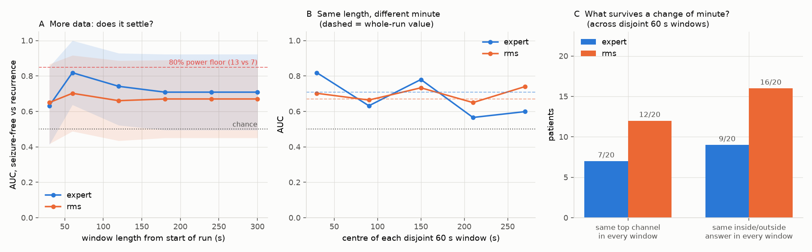
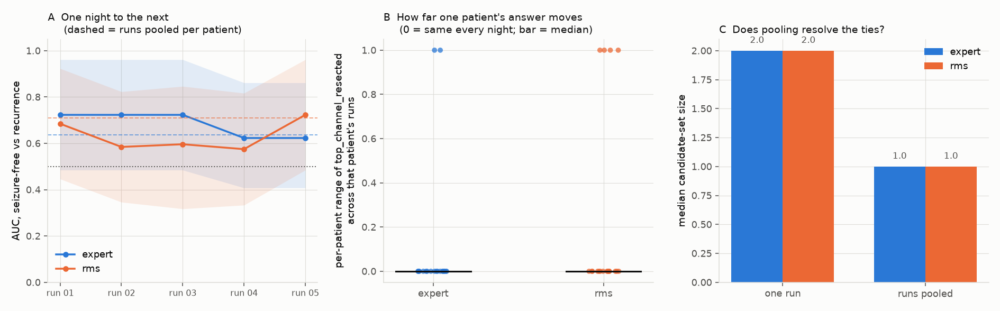

# Does the HFO map point at the tissue whose removal cured the patient?

Every other number in this project compares an algorithm to another
algorithm, or to a human reading the same screen. This one compares it to
**what happened to the patient after surgery** — the only reference standard
in epilepsy surgery that is not another opinion.

Run it:

```bash
python -m onset_hfo.cli outcome            # 20 patients, whole recordings (~2.2 GB, ~25 min)
python -m onset_hfo.cli outcome --stop 60  # the first minute only -- a different answer
```

Everything below comes out of that command. Tables are in
`artifacts/results/outcome_ds003498/`, which is not tracked; the group tables
are committed to [`data/stability/`](../data/stability) and the per-subject
ones to [`data/outcome/`](../data/outcome), so every number here can be
checked from a fresh clone with no download.

**To read this study one patient at a time**, rather than as the group tables
below, run the app and open **Patients** (`app/pages/6_Patients.py`): same
study, one row per person, with the caveats that apply to each of them —
resection coverage, tie-set size, and whether their answer held across the
minutes of a run and across nights.

---

## The headline, in one paragraph

**Nothing here separates the groups in a way that survives correction, and the
most important finding is that an earlier version of this analysis appeared
to.** On the whole
recording (300 s per patient, every expert marking), the channel with the
most expert-marked fast ripples was inside the resection in 11 of 13 patients
who became seizure-free and 3 of 7 whose seizures returned — AUC 0.71, 95% CI
0.50–0.92, permutation p = 0.12. Our detector, same channels, same metric:
10 of 13 versus 3 of 7, AUC 0.67, p = 0.17.

On the **first 60 seconds** of the same recordings, the same code, the same
pre-specified metric, the expert arm gave AUC **0.82, p = 0.007** — which is
what this document reported first, and what got put on the project's landing
page. It does not survive using the other four minutes. Two patients account
for the whole difference (§ "The window changes the answer"), which is what a
20-patient study with a binary per-patient metric looks like when it is
underpowered: individual patients move the result.

So the honest reading is **three statements, in this order**:

1. **The published retrospective claim is directionally reproduced and
   statistically unsupported here.** Seizure-free patients are more likely to
   have had their busiest fast-ripple channel removed (0.85 vs 0.43), the
   effect is in the direction Fedele et al. 2017 predicts, and with 13 versus
   7 patients it does not reach significance. That is a power statement, not a
   refutation.
2. **Our detector is close to the expert arm, not far from it.** AUC 0.67
   against 0.71, with overlapping intervals. The gap the 60-second analysis
   appeared to show (0.70 vs 0.82) largely closed — and it closed because the
   *expert* number came down, not because ours went up.
3. **The ranking is window-dependent, and that is now the most concrete
   problem in this repository.** A conclusion that changes between minute one
   and minutes one-to-five is not yet a measurement.

## How the question is posed

| Ingredient | Where it comes from |
|---|---|
| Where the HFOs are | expert markings in `*_events.tsv`, **and** our detector, on the same channels |
| Which tissue was removed | `sourcedata/clinical_ch_sheet_zurich.xlsx`, parsed by `onset_hfo.clinical` |
| What happened to the patient | `participants.tsv`: `S` = seizure-free (13), `F` = recurrence (7) |

For each patient we compute how much of their HFO activity sat in tissue the
surgeon removed, and ask whether that is higher in the patients who became
seizure-free.

### Contacts, channels, and the resection margin

The clinical sheet names **contacts** (`ahr1-4` → AHR1…AHR4). The analysis
runs on **bipolar channels** (`AHR1-AHR2`), each of which sits between two
contacts. So a channel can be:

- **resected** — both contacts removed;
- **partial** — one contact removed. These straddle the resection edge;
- **spared** — neither removed.

`partial` is kept as its own label rather than folded into one of the
others, because folding it either way is a silent decision about the hardest
channels in the dataset. In the primary metric it counts in the denominator
and not the numerator, so a detector that fires along the margin gets no
credit for it. `share_in_rz_incl_partial` is reported alongside for anyone
who disagrees.

### What was dropped, and what could not be seen

- Contacts the source study excluded because electrical stimulation of them
  evoked motor or language responses are dropped (`--keep-eloquent` keeps
  them). 30 channels across 3 subjects.
- **Resected contacts that were never recorded cannot be scored.** In 15 of
  20 subjects every resected contact is present. In the other five — all
  temporal-lobe cases, where the source study kept only the three most mesial
  bipolar channels — only 4 of 16 listed resected contacts were recorded.
  `recordings.csv` carries `rz_coverage` per subject, and those five sit at
  0.25. Their numbers describe a quarter of a resection.
- The clinical sheet contains one typo (subject 15's excluded list says
  `1ll22-24` where every other token on the row says `tll`). The parser
  reports it rather than silently returning a smaller zone; three contacts
  are consequently not marked eloquent for that subject.

### Four metrics, because they disagree

| metric | question |
|---|---|
| `share_in_rz` | what fraction of this patient's HFO events were on resected channels? |
| `share_in_rz_incl_partial` | …counting margin channels as inside |
| `top_channel_resected` | was the single busiest channel removed? (0/1) |
| `candidates_resected` | what share of the channels that cannot be told apart from the busiest one was removed? |
| `top3_resected` | what fraction of the three busiest channels was removed? |

They disagree sharply, and that disagreement is a finding in itself — see
"What the numbers say" below.

---

## Results

Cohort: all 20 subjects, **the whole run** (300 s, 2000 Hz), every expert
marking. Detector: RMS, at the per-band operating points measured in
[EVALUATION.md](EVALUATION.md) (2.0 SD ripples, 5.0 SD fast ripples). Scope
`reviewed` = the channels the annotators marked; `all` = every channel
surviving preprocessing.

### `top_channel_resected` — the metric the source study's claim rests on

| source | band | scope | seizure-free | recurrence | AUC (95% CI) | p |
|---|---|---|---|---|---|---|
| expert | **fast ripple** | reviewed | **11/13 (0.85)** | **3/7 (0.43)** | **0.71 (0.50–0.92)** | 0.12 |
| rms | fast ripple | reviewed | 10/13 (0.77) | 3/7 (0.43) | 0.67 (0.45–0.89) | 0.17 |
| rms | ripple | reviewed | 8/13 (0.62) | 1/7 (0.14) | 0.74 (0.55–0.92) | 0.07 |
| expert | ripple | reviewed | 4/13 (0.31) | 2/7 (0.29) | 0.51 (0.29–0.73) | 1.00 |
| rms | fast ripple | all | 7/13 (0.54) | 3/7 (0.43) | 0.56 (0.34–0.78) | 1.00 |

### `share_in_rz` — the metric that carries nothing

| source | band | scope | median (free) | median (recur) | AUC (95% CI) | p |
|---|---|---|---|---|---|---|
| expert | fast ripple | reviewed | 0.50 | 0.41 | 0.48 (0.22–0.77) | 0.94 |
| rms | fast ripple | reviewed | 0.80 | 0.22 | 0.71 (0.46–0.91) | 0.14 |
| expert | ripple | reviewed | 0.19 | 0.30 | 0.41 (0.15–0.68) | 0.54 |
| rms | ripple | reviewed | 0.48 | 0.38 | 0.52 (0.24–0.79) | 0.94 |

`top3_resected` sits between the two (expert fast ripple AUC 0.63, p = 0.35).
Of the 36 comparisons in the full table, **one** reaches p < 0.05 — our
detector, ripple band, `candidates_resected`, p = 0.034, Bonferroni 1.00 — and
chance alone would produce about two. Every metric, source, scope and band is
in `groups.csv`.

---

## The window changes the answer

This is the finding worth more than any row above, and it exists only because
the analysis was re-run on the full recording rather than declared finished on
the first minute.

| | expert, fast ripple | rms, fast ripple |
|---|---|---|
| **first 60 s** | 12/13 vs 2/7 — AUC **0.82**, p = **0.007** | 10/12 vs 3/7 — AUC 0.70, p = 0.13 |
| **whole 300 s** | 11/13 vs 3/7 — AUC 0.71, p = 0.12 | 10/13 vs 3/7 — AUC 0.67, p = 0.17 |

Five times the data, a weaker result. Two patients account for all of it:

- **sub-18** (recurrence). In the first minute the busiest expert-marked
  fast-ripple channel was outside the resection; over five minutes it is
  inside. A recurrence patient whose HFO focus *was* removed counts against
  the hypothesis, so this flip costs twice.
- **sub-15** (seizure-free). The opposite: inside at 60 s, outside at 300 s.

Our detector moved on two patients as well (sub-14 flipped out; sub-10, which
produced no fast-ripple detections at all in 60 s, produced 15 in 300 s and
rejoins the cohort — which is why its `n` goes from 12 to 13).

Three things follow, and they are the actionable part of this document:

**The 60-second number should never have been the headline.** It was not
cherry-picked — 60 s was chosen for download size before any outcome data was
touched, and the metric and band were pre-specified — but a window short
enough to change the conclusion is not a defensible analysis window, and the
default is now the whole run. Anything published from the 60 s window is
superseded by the table above.

**"Which channel is busiest" is a fragile statistic on this much data.** It is
an argmax over 6–65 channels whose rates have overlapping confidence
intervals. The next section measures exactly how fragile: across five disjoint
minutes of the same recording, the experts' busiest channel is the same channel
in only 7 of 20 patients.

**A 20-patient study cannot distinguish these two results from each other.**
`min_detectable_auc(13, 7)` = 0.85. Both 0.82 and 0.71 sit below that floor,
so neither run had the power to establish its own number. The window study
below puts a size on that noise: five equally long windows of the same
recordings give expert AUCs from 0.566 to 0.819.

---

## How stable is any of this? — the window study

Everything above is an argmax over 6–65 channels whose Poisson rate intervals
overlap. So the obvious question is whether it survives a change of analysis
window. `onset-hfo stability` answers it in two arms — growing windows from
the start of the run, and five **disjoint** 60-second windows that tile it —
because a growing-window curve alone cannot tell convergence from drift.

```bash
python -m onset_hfo.cli stability     # 11 windows, ~90 min after the first fetch
```



### The estimate settles, and 60 s was an excursion

| window | expert AUC | p | rms AUC | p |
|---|---|---|---|---|
| 0–30 s | 0.632 | 0.36 | 0.650 | 0.30 |
| **0–60 s** | **0.819** | **0.007** | 0.702 | 0.13 |
| 0–120 s | 0.742 | 0.06 | 0.661 | 0.33 |
| 0–180 s | 0.709 | 0.12 | 0.670 | 0.17 |
| 0–240 s | 0.709 | 0.12 | 0.670 | 0.17 |
| 0–300 s | 0.709 | 0.12 | 0.670 | 0.17 |

Identical from 180 s onward — not merely close, identical, meaning no
patient's answer changed in the last two minutes. The whole-run number is a
settled estimate of *this recording*, and the 60-second result was an
excursion rather than an undersampled version of it.

One caveat the table shows in its own `n` columns (`curve.csv`): at 30 s the
detector arm covers only 16 of 20 patients and at 60–120 s only 19, because
the rest produce no fast-ripple detections in that little data. Its short-window
points are computed over a different cohort and should not be read as part of
the same curve. The expert arm is 20 patients at every window.

### But which minute you pick matters

Five equally long, non-overlapping windows of the same recordings, analysed
identically:

| source | AUC range | sd | p range |
|---|---|---|---|
| expert | 0.566 – 0.819 | 0.113 | **0.007 – 0.613** |
| rms | 0.650 – 0.740 | 0.040 | 0.047 – 0.299 |

The expert p-value swings from 0.007 to 0.61 depending on which minute is
analysed. **The 0.007 that reached this project's README was the most
favourable of five minutes**, and nothing short of running this could have
revealed that.

### Our detector is more stable than the expert markings

The result this study was not designed to find:

| | expert | rms |
|---|---|---|
| same busiest channel in all five windows | 7/20 | **12/20** |
| same inside/outside answer in all five windows | 9/20 | **16/20** |
| AUC spread across minutes | 0.25 | **0.09** |

Some of that is deflation — a statistic nearer chance has less room to swing —
but not a threefold difference in spread. A threshold-crossing detector run
identically every minute is more reproducible than human marking, which is the
thing automation is supposed to buy and the first evidence here that this
pipeline buys it. Read it as *reproducibility*, not accuracy: the detector
agrees with itself more than the experts agree with themselves, and it is
still the experts who are closer to the outcome.

For the detector the honest footnote is that six patients have fewer than five
usable windows (no fast-ripple detections in some minute), so their "never
moves" is over fewer comparisons. The decision figure, 16/20, uses whatever
windows each patient has and reports the count in `decision_stability.csv`.

### Channel identity is fragile; the decision on top of it is less so

The two stability measures come apart — 7/20 against 9/20 for the experts,
12/20 against 16/20 for us — and the gap is the useful part. When the two or
three busiest channels are all inside the resection, or all outside it, the
argmax can wander between them without the answer changing. Worst case is
sub-12, where the experts' busiest channel is a *different channel in every
one of the five windows*.

**This argues for a design change.** A report from this pipeline should name a
*set of candidate channels* — those whose rates are not distinguishable from
the leader — rather than a winner. `metrics.leader_separation` already uses
exactly that rule to decide whether a recording has a leader at all;
`_top_channel_resected` took a bare argmax and did not. The next section is
what happened when that was fixed: the data picks a single channel in fewer
than half the patients, and reporting the tied set instead costs 0.017 AUC.

---

## Refusing to pick a winner

The window study said the busiest channel is often not the same channel. The
fix is not to pick more carefully, it is to stop picking when the data has not
picked: `candidate_channels` returns every channel whose Poisson rate interval
overlaps the leader's — the rule
:func:`onset_hfo.metrics.leader_separation` already uses to decide whether a
recording has a leader at all — and `candidates_resected` reports the share of
that set which was removed. It reduces to `top_channel_resected` exactly when
the set has one member, so it is a strict generalisation, not a different
question. The rule is an interval rather than a constant, so it tightens by
itself as the window grows and needed no tuning.

### Most of the time, the data did not pick one channel

| | expert | rms |
|---|---|---|
| patients where the leader stands alone | **9/20** | **8/20** |
| median candidate-set size | 2 | 2 |
| largest candidate set | 24 of 37 channels (sub-12) | 10 of 37 |

So `top_channel_resected` was reporting a winner the data had chosen in fewer
than half the patients. For sub-12 it named one channel out of **24 that
cannot be told apart from it**.

### It costs almost nothing at the group level

Fast-ripple band, reviewed channels, whole runs:

| source | metric | seizure-free | recurrence | AUC (95% CI) | p |
|---|---|---|---|---|---|
| expert | `top_channel_resected` | 0.85 | 0.43 | 0.709 (0.50–0.92) | 0.12 |
| expert | `candidates_resected` | 0.78 | 0.52 | 0.692 (0.45–0.91) | 0.15 |
| rms | `top_channel_resected` | 0.77 | 0.43 | 0.670 (0.45–0.89) | 0.17 |
| rms | `candidates_resected` | 0.77 | 0.50 | 0.670 (0.41–0.91) | 0.20 |

AUC moves by 0.017 for the experts and not at all for us in the fast-ripple
band. (In the *ripple* band the same metric is our detector's best row in the
whole study, p = 0.034 uncorrected — see the caution above: one hit in 36
comparisons is what chance produces.) **Being honest about ties is nearly
free**, which is the argument for doing it: the per-patient
statement becomes true without the cohort-level claim getting weaker.

`candidates_all_resected` — was the *whole* tied set removed? — is the more
demanding question and does worse (expert 0.665, p = 0.35; rms 0.593,
p = 0.64), which is what you would expect of a stricter criterion on twenty
patients.

### It makes the per-patient number steadier, and the group number no steadier

Across the five disjoint 60-second windows:

| | expert | rms |
|---|---|---|
| mean per-patient movement, `top_channel_resected` | 0.55 | 0.20 |
| mean per-patient movement, `candidates_resected` | **0.30** | **0.18** |
| AUC spread, `top_channel_resected` | 0.25 | 0.09 |
| AUC spread, `candidates_resected` | **0.16** | **0.24** |

Both arms' *per-patient* values move less — which is the point, since that is
what a clinician would read. The *group* statistic is another matter: its
spread halves for the experts and more than doubles for our detector.

The reason is visible in the set sizes. In a 60-second window the median
candidate set is 4.5 channels (expert) and 3.5 (rms), against 2 on the whole
run, and the set size swings by a mean of 7 and 9 channels respectively
between windows. Our detector sees a median of 30 fast-ripple events per
60-second window against the experts' 134, so its intervals are wider and its
set size is the more volatile of the two. **Candidate sets do not rescue a
short window; they make its uncertainty visible.** On the whole run — the
default — both arms sit at a median set of 2.

### What to use

Report `candidates_resected` and the set itself. `top_channel_resected` stays
in the tables because it is the pre-specified comparison and the one
comparable to the published literature, but it should not be quoted without
`n_candidates` beside it. A report that names one channel when eleven are tied
is not more decisive than one that names eleven; it is wrong in a way that
cannot be checked from the output.

---

## Does it hold from one night to the next?

The window study settles a question about **one recording**. Each patient here
contributed several, on different nights, and whether the answer holds between
them decides something that matters more: whether this is a *per-patient*
measurement or a *per-recording* one. Only the first is any use clinically.

```bash
python -m onset_hfo.cli stability --across-runs 5
```



First, a correction to something this repository believed. `participants.tsv`
has a `nights` column reading 1–6, and the archive turns out to hold **385
runs** across the 20 subjects — 1 to 39 each — because a night contributes
several five-minute segments. All of them is about 46 GB, so this study reads
the first five per subject (92 runs) and deletes each slice once it has been
analysed.

### A whole run is a stable unit of measurement; a minute is not

The per-patient answer, across that patient's own runs:

| | across 5 disjoint **minutes** of one run | across 5 **runs** (different nights) |
|---|---|---|
| expert | 9/20 patients unchanged | **18/20** |
| rms | 16/20 | **16/20** |

This is the clearest result in the whole stability exercise. The expert
markings doubled their agreement with themselves when the unit of analysis
became a whole run instead of a minute of one, and only `sub-08` and `sub-18`
move at all. Our detector is unchanged at 16/20 — it was already the more
reproducible of the two at short windows, and it gains nothing from the longer
unit because it had not lost anything.

The group statistic moves correspondingly little between nights: expert AUC
0.623–0.723 (range 0.100), ours 0.575–0.723 (range 0.148), against 0.253 and
0.090 between minutes.

**Read the per-run numbers with one caveat.** Two subjects (`sub-07`,
`sub-17`, both recurrences) have a single run in the archive, so the per-run
comparison is restricted to the 18 subjects present in every run — **13
seizure-free against 5** — to avoid comparing different cohorts across runs.
That is a smaller and more fragile comparison than the pooled one below, and
its absolute AUCs are not comparable to the 13-vs-7 numbers elsewhere in this
document.

### Pooling a patient's runs resolves the ties

| | one run | runs pooled |
|---|---|---|
| median candidate-set size, expert | 2 | **1** |
| median candidate-set size, rms | 2 | **1** |
| largest set, expert | 24 channels | **5** |
| largest set, rms | 37 channels | **5** |
| patients where the leader stands alone, expert | 48% of runs | **13/20** |

This is what more recording was supposed to buy and, unlike the window study,
it delivers: the Poisson intervals narrow, ties resolve, and the worst case
stops being absurd. A patient whose busiest channel could not be told apart
from 23 others in one run has a set of at most five once five runs are added
together.

### It does not rescue the group result

| source | metric | seizure-free | recurrence | AUC | p |
|---|---|---|---|---|---|
| expert | `top_channel_resected` | 0.85 | 0.57 | 0.637 | 0.29 |
| rms | `top_channel_resected` | 0.85 | 0.43 | 0.709 | 0.12 |
| expert | `candidates_resected` | 0.89 | 0.59 | 0.709 | 0.09 |
| rms | `candidates_resected` | 0.74 | 0.50 | 0.632 | 0.36 |
| rms | `top_channel_resected` (ripple) | 0.62 | 0.14 | 0.736 | 0.07 |

**Nothing in the pooled table reaches p < 0.05**; its minimum is 0.070.
Pooling actually *lowers* the expert argmax arm (0.709 on a single run
to 0.637), because the recurrence group's mean rises from 0.43 to 0.57 — with
more data, more recurrence patients turn out to have had their busiest
fast-ripple channel removed, which is evidence against the hypothesis rather
than noise in our favour.

One line that will be tempting to quote and should not be: pooled, **our
detector edges the expert markings** on the pre-specified metric for the first
time (0.709 against 0.637). At p = 0.12, on 20 patients, in a table of 24
comparisons, that is what a coin does. It is in the table because leaving it
out would be the same sin as quoting it.

### What this settles

The per-patient answer **is** stable across nights, so the quantity this
pipeline measures is a property of the patient rather than of the recording
session. That was the open question, and it is the precondition for anything
clinical. What remains unsettled is whether the quantity *predicts outcome*,
and twenty patients cannot settle it — every arm of every study here sits
below the AUC 0.85 this cohort would need.

---

## What the numbers say

**Fast ripples localise better than ripples in the expert arm; in ours the two
bands are indistinguishable.** For the experts, fast ripples give AUC 0.71
against 0.51 for ripples, on the same patients, channels and metric — matching
a decade of clinical literature holding that ripples are the less specific
marker. For our detector the ripple arm (0.74, p = 0.07) actually edges the
fast-ripple arm (0.67, p = 0.17), and the intervals overlap heavily. Read that
as "our detector does not reproduce the band distinction", not as "ripples are
better": with this cohort neither number is established, and taking the
larger one because it is larger is the error this document exists to avoid.
Either way, it is why these 2 kHz recordings matter — the project's other
dataset is 1 kHz and cannot support fast-ripple analysis at all.

**Concentration localises; proportion does not.** `share_in_rz` shows nothing
in the expert arm at all (AUC 0.48 — a coin flip), while
`top_channel_resected` on exactly the same events gives 0.71. The clinically
useful statement is not *most of this patient's HFOs were in the resection* —
that is largely a statement about how large the resection was — but *the one
place generating the most fast ripples was removed*. Anyone building a report
from this pipeline should show a ranking, not a percentage. This is the one
conclusion that held identically at both window lengths.

**Band-specific operating points are not a refinement, they are the
difference between a result and noise.** The first version of this analysis
used 2.0 SD in both bands, because that is the value the ripple benchmark
prefers. In the fast-ripple band 2.0 SD runs at precision 0.086 — a mean of
1,142 detections per 60 s against a mean of 228 expert-marked fast ripples —
and the detector's outcome arm was correspondingly flat. At the fast-ripple
band's own measured operating point (5.0 SD, rank ρ 0.610) the same code
recovers a usable ranking. Nothing about the outcome data was used to pick
either number; both come from channel-rank agreement with the experts, which
is a different question on data that says nothing about surgery.

**The event-starvation problem was real and the full run fixes it.** At 5.0 SD
in 60 s, five of twenty subjects yielded one or zero fast-ripple detections
and sub-10 yielded none at all, so a per-patient statistic was being computed
from a single event. Over 300 s every subject produces detections and the
cohort is complete. That was a genuine defect of the 60-second window — it is
just not the defect that was holding the detector back.

**The positive control did its job, and what it revealed was not what it was
built to reveal.** It was built to tell "our detector is worse than the
experts" apart from "this study is underpowered". The 60-second run looked
like the first. The full run says the second: expert 0.71 and ours 0.67, both
null, intervals almost entirely overlapping. A control that changes the
conclusion when you give it more data has earned its place.

## What this cannot support

- **Thirteen versus seven is a very small study.** `min_detectable_auc(13, 7)`
  returns **0.85**: with these group sizes, only a very large separation
  reaches 80% power. A p above 0.05 here means "underpowered", not "no
  effect". Every row carries an effect size and a bootstrap CI for that
  reason.
- **Thirty-six comparisons, uncorrected.** The Bonferroni column is in the
  table and **nothing survives it**. One row reaches p < 0.05 uncorrected (our
  detector, ripple band, `candidates_resected`, p = 0.034), which is fewer than
  the ~2 that 36 tests produce by chance. Read every row as
  hypothesis-generating.
- **The published headline changed once already.** The 60-second version of
  this analysis reported AUC 0.82, p = 0.007 and it reached the project's
  README and landing page before the full run was done. Both are now corrected
  to the table above. Treat that as the calibration for how much weight any
  single number in this document can carry.
- **One full run of one night** is not what the source study used: the
  patients contributed 1–6 nights each and it scored all of them. The archive
  has 1–6 runs per subject; combining them is the obvious next extension, and
  given how much the answer moved between one minute and five, it should be
  done before any number here is quoted as stable.
- **One run per patient, no cross-validation, no held-out set.** Nothing here
  is a model that was fitted, so there is nothing to hold out — but there is
  also nothing here that has been shown to generalise to another cohort.
- **Retrospective, single centre, one surgical team.** The HFO Trial
  (Jacobs et al., *Lancet Neurology* 2022) tested HFO-guided resection
  prospectively and did not find the benefit that retrospective series
  reported. This analysis is a retrospective series. See
  [LIMITATIONS.md](LIMITATIONS.md).

---

## Reproducing and extending

```bash
python -m onset_hfo.cli outcome                        # the table above (whole runs)
python -m onset_hfo.cli outcome --stop 60              # the first minute: a different answer
python -m onset_hfo.cli outcome --stop 120 --out a     # your own window-sensitivity check
python -m onset_hfo.cli outcome --threshold 3.0        # one threshold in every band
python -m onset_hfo.cli outcome --detector line_length
python -m onset_hfo.cli outcome --keep-eloquent        # keep stimulation-positive contacts
```

In Python:

```python
from onset_hfo.outcome import outcome_study

result = outcome_study()
print(result.summary("top_channel_resected"))
print(result.verdict(band="fast_ripple"))
result.save()
```

`result.channels` has every channel of every subject with its zone, its
expert event count and ours — which is where to look first when a subject's
number is surprising.

**That experiment is now built**: `onset-hfo stability`, and
:mod:`onset_hfo.stability` if you want to drive it from Python. The next one
is combining a patient's several runs rather than lengthening a single one.

### Files written

| file | contents |
|---|---|
| `subjects.csv` | one row per subject × source × scope × band: the per-patient metrics |
| `channels.csv` | per-channel zone, expert events, our events — the audit trail |
| `recordings.csv` | what was analysed per subject, including `rz_coverage` |
| `groups.csv` | the group comparison, every metric |
| `participants.csv` | outcome, ILAE class, follow-up, epilepsy type, as published |
| `run.json` | dataset, window, detector, thresholds, power floor, verdict |

### Source

Fedele T, Burnos S, Boran E, Krayenbühl N, Hilfiker P, Grunwald T, Sarnthein J.
*Resection of high frequency oscillations predicts seizure outcome in the
individual patient.* Scientific Reports 7:13836 (2017).
doi:[10.1038/s41598-017-13064-1](https://doi.org/10.1038/s41598-017-13064-1).
Data: OpenNeuro [ds003498](https://openneuro.org/datasets/ds003498), CC0.
